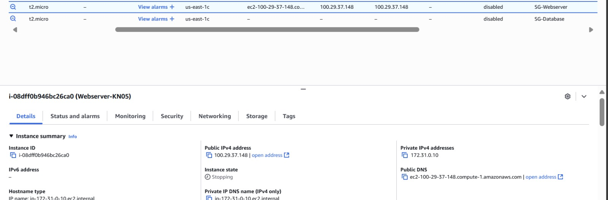
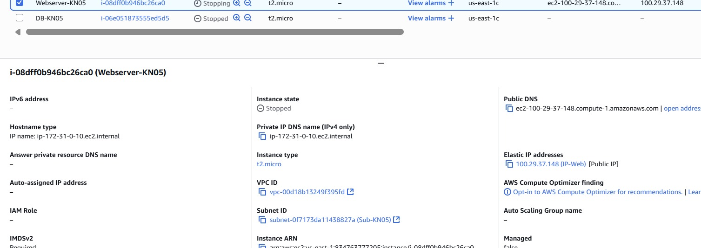

# KN05 – Netzwerk & Sicherheit

Autor: Michael Eaton

# Kernkonzepte & Entscheidungen (Networking/Cloud)

## 1) Kernkonzepte (in eigenen Worten)

### VPC
- **Was ist es?**  
  Ein isoliertes, virtuelles Netzwerk im Cloud-Provider, in dem ich eigene IP-Bereiche, Subnetze, Routen und Sicherheitsregeln definiere.
- **Wofür brauche ich es in dieser Aufgabe?**  
  Um meine App-Ressourcen (Web, DB, Bastion) sicher voneinander und von anderen Projekten zu trennen und den Datenverkehr gezielt zu steuern.
- **Beispiel aus meiner Umsetzung:**  
  VPC `app-vpc` mit CIDR `10.0.0.0/16`, darin je ein öffentliches und ein privates Subnetz, plus eine Routing-Tabelle pro Subnetz.

### Subnetz
- **Was ist es?**  
  Ein in der VPC definierter IP-Teilbereich (z. B. `10.0.1.0/24`), in dem Instanzen platziert werden.
- **Warum trenne ich Dienste in Subnetze?**  
  Sicherheits- und Routing-Trennung: öffentlich erreichbare Komponenten (LB/Web) ins Public Subnet, interne Komponenten (DB/Cache) ins Private Subnet.
- **Beispiel:**  
  `public-subnet (10.0.1.0/24)` für Load Balancer + NAT, `private-subnet (10.0.2.0/24)` für Datenbank/Backend.

### Öffentliche IP
- **Eigenschaften / Sichtbarkeit:**  
  Global im Internet routbar; kann von jedem erreicht werden, wenn Security-Regeln es erlauben.
- **Typischer Einsatz (z. B. Webserver):**  
  Load Balancer, Bastion Host oder direkt ein Webserver (besser via LB); DNS zeigt auf diese IP bzw. deren Namen.

### Private IP
- **Eigenschaften / Sichtbarkeit:**  
  Nur innerhalb der VPC (und ggf. per Peering/VPN) erreichbar; nicht direkt aus dem Internet sichtbar.
- **Typischer Einsatz (z. B. DB ↔ Webserver intern):**  
  Datenbank, interne Microservices, Redis/Cache – Kommunikation ausschließlich intern über private IPs.

### Statische IP
- **Was bedeutet „statisch“?**  
  Eine feste, nicht wechselnde IP-Adresse (reserviert), die über Neustarts/Neuzuweisungen gleich bleibt.
- **Nutzen in meinem Setup (z. B. ändert sich nicht nach Neustart):**  
  Vereinfachtes DNS/Firewalling: Ich binde z. B. den öffentlichen LB an eine statische IP, Regeln und DNS bleiben stabil.

---

## 2) Eigene Entscheidungen / Begründungen

- **Warum habe ich diese IP-Typen gewählt?**  
  - **Public IP** nur am **Load Balancer/Bastion**: Minimiert die Angriffsfläche; Web-Traffic geht über den LB, Admin-Zugriff über Bastion (beides kontrolliert per Security Groups/Firewall).  
  - **Private IPs** für **Datenbank/Backend**: Sensible Dienste sind nicht direkt aus dem Internet erreichbar, nur aus dem Private Subnet.  
  - **Statische IP** für **LB/Bastion**: DNS-Einträge und erlaubte Quell-/Ziel-Adressen in Firewalls bleiben konstant; keine Ausfälle durch IP-Wechsel.

- **Was wäre die Alternative gewesen?**  
  - **Alles im Public Subnet mit Public IPs:** Einfacher, aber unsicher; jede VM exponiert.  
  - **Dynamische (ephemere) Public IP am Webserver:** Funktioniert, aber DNS/Firewall müssen bei IP-Wechseln nachgezogen werden.  
  - **Kein LB, Public IP direkt am Webserver:** Geringere Kosten/Komplexität, aber keine Blue/Green-Deployments, kein zentrales SSL/TLS-Offloading, schlechtere Skalierung.  
  - **Ein einziges Subnetz:** Weniger Verwaltung, aber keine klare Trennung von externen und internen Diensten, schwächere Sicherheitskontrollen.

# Netzwerk-Doku

## Subnetz

  
*Bild von: Eigene Arbeit*

## IP-Plan (privates Netz)

- Webserver: 172.31.0.10  
- Datenbank: 172.31.0.20

## B) Objekte und Instanzen erstellen

  
*Bild von: Eigene Arbeit*

  
*Bild von: Eigene Arbeit*

  
*Bild von: Eigene Arbeit*

  
*Bild von: Eigene Arbeit*

  
*Bild von: Eigene Arbeit*

  
*Bild von: Eigene Arbeit*

  
*Bild von: Eigene Arbeit*

