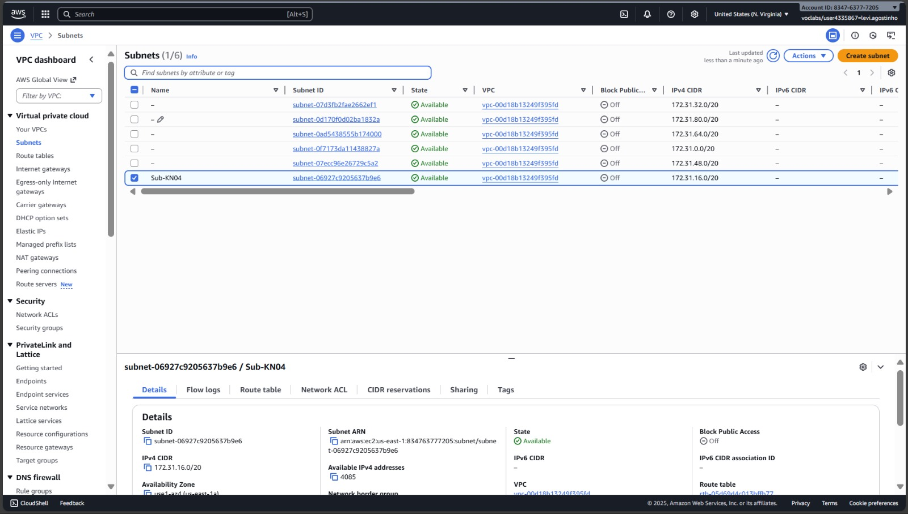
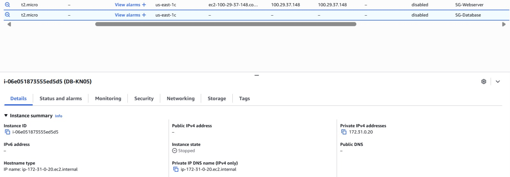
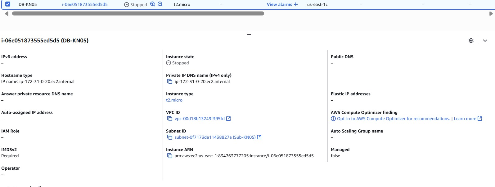
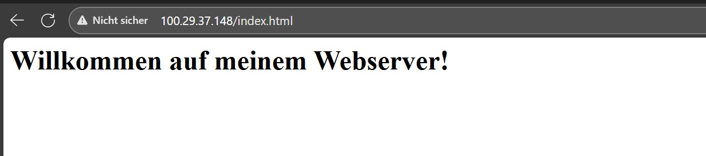
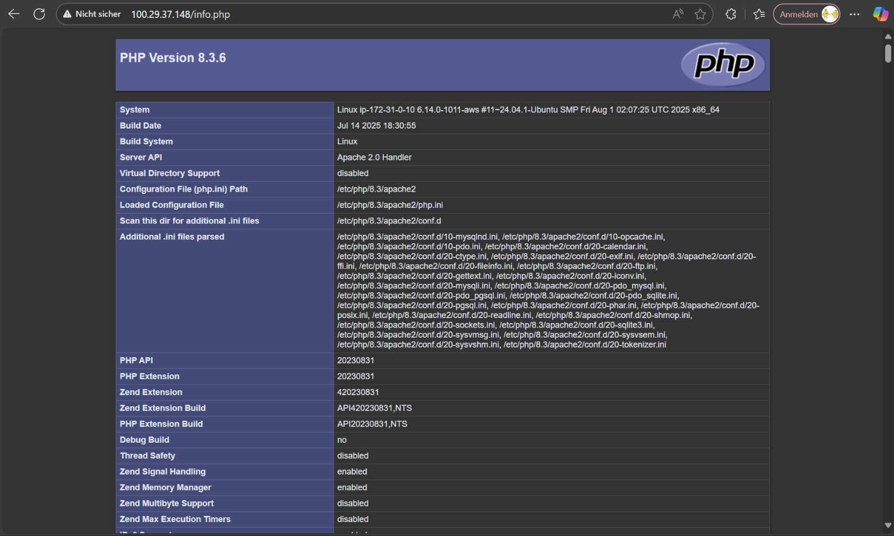
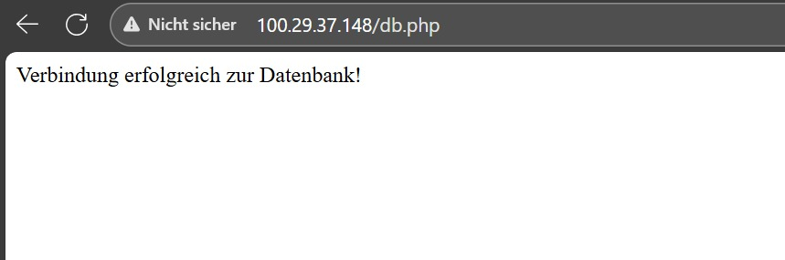

# KN05 – Netzwerk & Sicherheit

Autor: Michael Eaton

## 1) Kernkonzepte (in eigenen Worten)

### VPC
- Was ist es? …
- Wofür brauche ich es in dieser Aufgabe? …
- Beispiel aus meiner Umsetzung: …

### Subnetz
- Was ist es? …
- Warum trenne ich Dienste in Subnetze? …
- Beispiel: …

### Öffentliche IP
- Eigenschaften / Sichtbarkeit: …
- Typischer Einsatz (z. B. Webserver): …

### Private IP
- Eigenschaften / Sichtbarkeit: …
- Typischer Einsatz (z. B. DB ↔ Webserver intern): …

### Statische IP
- Was bedeutet „statisch“? …
- Nutzen in meinem Setup (z. B. ändert sich nicht nach Neustart): …

## 2) Eigene Entscheidungen / Begründungen
- Warum habe ich diese IP-Typen gewählt? …
- Was wäre die Alternative gewesen? …

# Netzwerk-Doku

## Subnetz

  
*Bild von: Eigene Arbeit*

## IP-Plan (privates Netz)

- Webserver: 172.31.0.10  
- Datenbank: 172.31.0.20

## B) Objekte und Instanzen erstellen

  
*Bild von: Eigene Arbeit*

  
*Bild von: Eigene Arbeit*

  
*Bild von: Eigene Arbeit*

  
*Bild von: Eigene Arbeit*

  
*Bild von: Eigene Arbeit*

  
*Bild von: Eigene Arbeit*

  
*Bild von: Eigene Arbeit*

