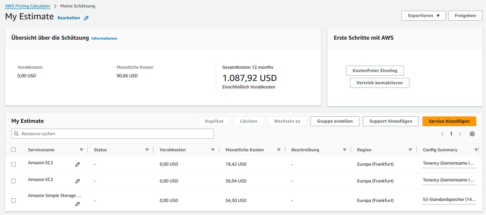

# KN10 – Kostenberechnung Cloud-Migration (2025)
**Migrationspfade:** Rehosting (IaaS) mit AWS & Azure • Replatforming (PaaS) via Heroku • Repurchasing (SaaS) mit Zoho CRM & Salesforce

---

## Ausgangslage

- **Benutzerzahl:** 30
- **Aktuelle On-Premise Infrastruktur:**
  - **Webserver:** 1 Core, 2 GB RAM, 20 GB Disk, Ubuntu
  - **Datenbank:** 2 Cores, 4 GB RAM, 100 GB Disk, Ubuntu
  - **Backup-Regel:** täglich (7), wöchentlich (4), monatlich (3)  
    ⇒ Richtwert Gesamtvolumen Backups: **~150 GB**

---

## A) IaaS – Rehosting (AWS & Azure) — 60 %

### AWS (Region: Europa/Frankfurt)

**Auswahl & Preise:**
- **EC2 Web:** `t3.small` (2 vCPU, 2 GB RAM) – **$0.0208/h** ⇒ etwa **$15.18/Monat**
- **EC2 DB:** `t3.medium` (2 vCPU, 4 GB RAM) – **$0.0416/h** ⇒ etwa **$30.37/Monat**
- **EBS gp3 Storage:**
  - 20 GB ⇒ $0.08/GB ⇒ **$1.60**
  - 100 GB ⇒ **$8.00**
- **S3 Backups:** 150 GB × $0.023/GB ⇒ **$3.45/Monat**
- **Datenverkehr (Outbound ~200 GB):** **ca. $10.80/Monat**

**Gesamtschätzung AWS:** **~ $69/Monat** (≈ **$830/Jahr**)

<!-- Farbig formatierte Tabelle für bessere Übersicht -->
<table style="width:100%; border-collapse:collapse; font-family:system-ui, -apple-system, Segoe UI, Roboto, Arial; font-size:14px;">
  <thead>
    <tr style="background:#0d3b66; color:#fff; text-align:left;">
      <th style="padding:10px; border:1px solid #e5e7eb;">Komponente</th>
      <th style="padding:10px; border:1px solid #e5e7eb;">Menge</th>
      <th style="padding:10px; border:1px solid #e5e7eb;">Einzelpreis</th>
      <th style="padding:10px; border:1px solid #e5e7eb;">Kosten / Monat</th>
    </tr>
  </thead>
  <tbody>
    <tr style="background:#f8fafc;">
      <td style="padding:10px; border:1px solid #e5e7eb;">EC2 Web</td>
      <td style="padding:10px; border:1px solid #e5e7eb;">1</td>
      <td style="padding:10px; border:1px solid #e5e7eb;">$0.0208/h</td>
      <td style="padding:10px; border:1px solid #e5e7eb;">$15.18</td>
    </tr>
    <tr style="background:#ffffff;">
      <td style="padding:10px; border:1px solid #e5e7eb;">EC2 DB</td>
      <td style="padding:10px; border:1px solid #e5e7eb;">1</td>
      <td style="padding:10px; border:1px solid #e5e7eb;">$0.0416/h</td>
      <td style="padding:10px; border:1px solid #e5e7eb;">$30.37</td>
    </tr>
    <tr style="background:#f8fafc;">
      <td style="padding:10px; border:1px solid #e5e7eb;">EBS Storage</td>
      <td style="padding:10px; border:1px solid #e5e7eb;">120 GB</td>
      <td style="padding:10px; border:1px solid #e5e7eb;">$0.08/GB</td>
      <td style="padding:10px; border:1px solid #e5e7eb;">$9.60</td>
    </tr>
    <tr style="background:#ffffff;">
      <td style="padding:10px; border:1px solid #e5e7eb;">S3 Backup</td>
      <td style="padding:10px; border:1px solid #e5e7eb;">150 GB</td>
      <td style="padding:10px; border:1px solid #e5e7eb;">$0.023/GB</td>
      <td style="padding:10px; border:1px solid #e5e7eb;">$3.45</td>
    </tr>
    <tr style="background:#f8fafc;">
      <td style="padding:10px; border:1px solid #e5e7eb;">Data Transfer (Outbound)</td>
      <td style="padding:10px; border:1px solid #e5e7eb;">200 GB</td>
      <td style="padding:10px; border:1px solid #e5e7eb;">$0.108/GB</td>
      <td style="padding:10px; border:1px solid #e5e7eb;">$10.80</td>
    </tr>
    <tr style="background:#e6f4ea; font-weight:600;">
      <td colspan="3" style="padding:10px; border:1px solid #e5e7eb;">Summe pro Monat</td>
      <td style="padding:10px; border:1px solid #e5e7eb;">≈ $69.00</td>
    </tr>
    <tr style="background:#e6f4ea; font-weight:600;">
      <td colspan="3" style="padding:10px; border:1px solid #e5e7eb;">Hochrechnung pro Jahr</td>
      <td style="padding:10px; border:1px solid #e5e7eb;">≈ $830.00</td>
    </tr>
  </tbody>
</table>

> **Screenshots:**  
>   
>   
>   
> 

**Begründung (kompakt):**  
`t3`-Instanzen eignen sich für kleine Workloads, weil sie mit CPU-Credits kurzzeitige Lastspitzen abfangen.  
`gp3`-Volumes sind gegenüber `gp2` kostengünstiger, und S3 ist ideal für Backups.  
Der Webserver wurde mit 2 vCPUs (statt 1 Core) dimensioniert, um Leistungsreserve zu haben.

---

### Microsoft Azure (Regionen: Schweiz Nord / Westeuropa)

**Konfiguration:**
- VM-Typ: `B2als v2` (2 vCPU, 4 GB RAM) – **$0.048/h**
- Betriebssystem: Ubuntu Linux (Standard-Tier)
- Kein Managed Disk / kein zusätzlicher Storage

**Monatskosten:**
- Schweiz Nord: ≈ **$34.68 / Monat**
- Westeuropa: ≈ **$31.54 / Monat**
- Durchschnitt (gerundet): **≈ $33 / Monat** für eine VM

> **Screenshots:**  
> 

**Begründung (Azure):**  
Azure liefert eine vergleichbare Performance wie AWS, mit leichten Preisunterschieden je nach Region.  
Ich habe **Pay-as-you-go** gewählt, um flexibel zu bleiben.  
Für den Datenbankserver käme eine zweite VM desselben Typs hinzu – damit lägen die Gesamtkosten bei **ca. $66/Monat**.

---

## B) PaaS – Replatforming (Heroku) — 20 %

### Heroku – Konfiguration 

**App-Server**
- Plan: Standard-2X  
- Ressourcen: 1 GB RAM  
- Kosten: **$50/Monat**

**Datenbank**
- Produkt: Postgres Premium 1  
- Ressourcen: 100 MB, 80 Connections  
- Kosten: **$30/Monat**

**Summe & Hochrechnung**
- Monatlich: **$50 + $30 = $80/Monat**  
- Jährlich: **$80 × 12 = $960/Jahr**

> **Screenshots:**  
>   
> 

**Begründung (Heroku):**  
Heroku übernimmt Betriebssystem, Laufzeitumgebung, Updates und Skalierung vollständig.  
Das macht den Dienst teurer als AWS/Azure, reduziert aber den Administrationsaufwand deutlich.  
Damit eignet sich Heroku besonders für kleinere Teams ohne dedizierte Infra-Admins.

---

## C) SaaS – Repurchasing (Zoho CRM & Salesforce) — 10 %

### Zoho CRM
- **Professional-Plan:** $23 pro User/Monat  
- 30 User × $23 = **$690 / Monat** (≈ **$8 280 / Jahr**)

> 

### Salesforce Sales Cloud
- **Professional-Plan:** $80 pro User/Monat  
- 30 User × $80 = **$2 400 / Monat** (≈ **$28 800 / Jahr**)

> 

**Begründung (SaaS):**  
Beide Lösungen bieten vollständige CRM-Funktionalität.  
**Zoho** ist deutlich günstiger, hat jedoch weniger native Integrationen.  
**Salesforce** ist sehr leistungsfähig, richtet sich preislich eher an größere Unternehmen.

## D) Interpretation der Resultate — 10 %

### 1️⃣ Kostenüberblick 

<!-- Farbig formatierte Tabelle für bessere Übersicht -->
<table style="width:100%; border-collapse:collapse; font-family:system-ui, -apple-system, Segoe UI, Roboto, Arial; font-size:14px;">
  <thead>
    <tr style="background:#0d3b66; color:#fff; text-align:left;">
      <th style="padding:10px; border:1px solid #e5e7eb;">Modell</th>
      <th style="padding:10px; border:1px solid #e5e7eb;">Plattform</th>
      <th style="padding:10px; border:1px solid #e5e7eb;">Monat</th>
      <th style="padding:10px; border:1px solid #e5e7eb;">Jahr</th>
      <th style="padding:10px; border:1px solid #e5e7eb;">Aufwand</th>
    </tr>
  </thead>
  <tbody>
    <tr style="background:#f8fafc;">
      <td style="padding:10px; border:1px solid #e5e7eb;">IaaS</td>
      <td style="padding:10px; border:1px solid #e5e7eb;">AWS</td>
      <td style="padding:10px; border:1px solid #e5e7eb;">~ $69</td>
      <td style="padding:10px; border:1px solid #e5e7eb;">~ $830</td>
      <td style="padding:10px; border:1px solid #e5e7eb;">Hoch</td>
    </tr>
    <tr style="background:#ffffff;">
      <td style="padding:10px; border:1px solid #e5e7eb;">IaaS</td>
      <td style="padding:10px; border:1px solid #e5e7eb;">Azure</td>
      <td style="padding:10px; border:1px solid #e5e7eb;">~ $66</td>
      <td style="padding:10px; border:1px solid #e5e7eb;">~ $792</td>
      <td style="padding:10px; border:1px solid #e5e7eb;">Hoch</td>
    </tr>
    <tr style="background:#f8fafc;">
      <td style="padding:10px; border:1px solid #e5e7eb;">PaaS</td>
      <td style="padding:10px; border:1px solid #e5e7eb;">Heroku</td>
      <td style="padding:10px; border:1px solid #e5e7eb;">~ $80</td>
      <td style="padding:10px; border:1px solid #e5e7eb;">~ $960</td>
      <td style="padding:10px; border:1px solid #e5e7eb;">Mittel</td>
    </tr>
    <tr style="background:#ffffff;">
      <td style="padding:10px; border:1px solid #e5e7eb;">SaaS</td>
      <td style="padding:10px; border:1px solid #e5e7eb;">Zoho CRM</td>
      <td style="padding:10px; border:1px solid #e5e7eb;">~ $690</td>
      <td style="padding:10px; border:1px solid #e5e7eb;">~ $8 280</td>
      <td style="padding:10px; border:1px solid #e5e7eb;">Niedrig</td>
    </tr>
    <tr style="background:#ffffff;">
      <td style="padding:10px; border:1px solid #e5e7eb;">SaaS</td>
      <td style="padding:10px; border:1px solid #e5e7eb;">Salesforce</td>
      <td style="padding:10px; border:1px solid #e5e7eb;">~ $2 400</td>
      <td style="padding:10px; border:1px solid #e5e7eb;">~ $28 800</td>
      <td style="padding:10px; border:1px solid #e5e7eb;">Niedrig</td>
    </tr>
  </tbody>
</table>

---

### 2️⃣ Warum variieren die Kosten?

- **IaaS:** Günstig, da primär Infrastruktur berechnet wird; Betrieb (Patching, Monitoring) bleibt inhouse.  
- **PaaS:** Etwas teurer, übernimmt OS- und Laufzeitmanagement, wodurch Ops-Aufwand sinkt.  
- **SaaS:** Höchste Preise, da der Anbieter die komplette Lösung bis zur Anwendung verantwortet.  
Kurz: Je weniger Eigenbetrieb, desto mehr Kosten werden an den Anbieter ausgelagert.

---

### 3️⃣ interner Aufwand nach Modell

<!-- Kompakte Aufwandstabelle -->
<table style="width:100%; border-collapse:collapse; font-family:system-ui, -apple-system, Segoe UI, Roboto, Arial; font-size:14px;">
  <thead>
    <tr style="background:#1e293b; color:#fff; text-align:left;">
      <th style="padding:10px; border:1px solid #e5e7eb;">Modell</th>
      <th style="padding:10px; border:1px solid #e5e7eb;">Aufwand</th>
      <th style="padding:10px; border:1px solid #e5e7eb;">Kurzbeschreibung</th>
    </tr>
  </thead>
  <tbody>
    <tr style="background:#f8fafc;">
      <td style="padding:10px; border:1px solid #e5e7eb;">IaaS</td>
      <td style="padding:10px; border:1px solid #e5e7eb;">Hoch</td>
      <td style="padding:10px; border:1px solid #e5e7eb;">Server-Setup, Patching, Monitoring in Eigenverantwortung</td>
    </tr>
    <tr style="background:#ffffff;">
      <td style="padding:10px; border:1px solid #e5e7eb;">PaaS</td>
      <td style="padding:10px; border:1px solid #e5e7eb;">Mittel</td>
      <td style="padding:10px; border:1px solid #e5e7eb;">App-Fokus, Infrastruktur- und OS-Wartung weitgehend abgenommen</td>
    </tr>
    <tr style="background:#f8fafc;">
      <td style="padding:10px; border:1px solid #e5e7eb;">SaaS</td>
      <td style="padding:10px; border:1px solid #e5e7eb;">Gering</td>
      <td style="padding:10px; border:1px solid #e5e7eb;">Benutzerverwaltung und Konfiguration im Vordergrund</td>
    </tr>
  </tbody>
</table>

---

### 4️⃣ Empfehlung 

- **Technische Migration beibehalten:** **IaaS (AWS oder Azure)** ist kosteneffizient.  
- **Ops-Aufwand minimieren:** **PaaS (Heroku)** für einfache, wartungsarme Bereitstellung.  
- **CRM neu beschaffen:** **Zoho CRM (SaaS)** ist wirtschaftlich; **Salesforce** lohnt primär bei komplexen Anforderungen größerer Unternehmen.

