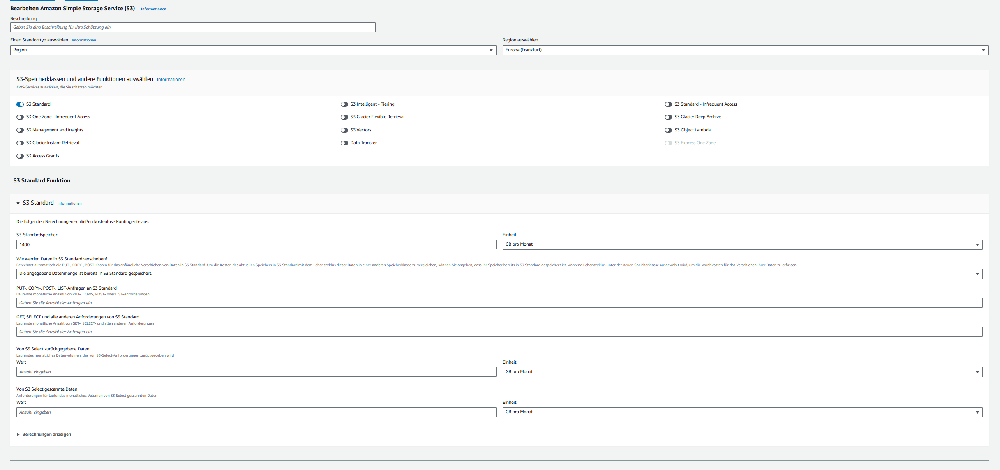

# KN10 – Kostenberechnung Cloud-Migration (2025)
**Rehosting (IaaS): AWS & Azure • Replatforming (PaaS): Heroku • Repurchasing (SaaS): Zoho CRM & Salesforce**

---

## Ausgangslage

- **Benutzer:** 30
- **On-Premise Infrastruktur:**
  - Webserver: 1 Core, 2 GB RAM, 20 GB Disk, Ubuntu
  - Datenbank: 2 Cores, 4 GB RAM, 100 GB Disk, Ubuntu
  - Backup: täglich (7), wöchentlich (4), monatlich (3)  
    → insgesamt ca. **150 GB** Datenmenge als Richtwert

---

## A) IaaS – Rehosting (AWS & Azure) — 60 %

### AWS (Region: Europa/Frankfurt)

**Auswahl:**
- EC2 Web: `t3.small` (2 vCPU, 2 GB RAM) – **$0.0208 / h** ⇒ ca. **$15.18 / Monat**
- EC2 DB: `t3.medium` (2 vCPU, 4 GB RAM) – **$0.0416 / h** ⇒ ca. **$30.37 / Monat**
- EBS gp3:
  - 20 GB ⇒ $0.08 / GB ⇒ **$1.60**
  - 100 GB ⇒ **$8.00**
- S3 Backups: 150 GB × $0.023 / GB ⇒ **$3.45 / Monat**
- Datenverkehr (Outbound ~ 200 GB): **ca. $10.80**

**Geschätzte Gesamtkosten AWS: ~ $69 / Monat (≈ $830 / Jahr)**

| Komponente | Menge | Einzelpreis | Kosten / Monat |
|-------------|--------|--------------|----------------|
| EC2 Web | 1 | $0.0208/h | $15.18 |
| EC2 DB | 1 | $0.0416/h | $30.37 |
| EBS Storage | 120 GB | $0.08/GB | $9.60 |
| S3 Backup | 150 GB | $0.023/GB | $3.45 |
| Data Transfer | 200 GB | $0.108/GB | $10.80 |

> **Screenshots:**  
> )  
>   
>   
> 

**Begründung:**  
`t3`-Instanzen sind für kleine Server ideal, weil sie Credits für kurzzeitige CPU-Spitzen haben.  
Mit `gp3`-Volumes spart man gegenüber `gp2` einiges an Kosten, und S3 ist perfekt für Backups.  
Ich habe den Webserver mit 2 vCPUs statt nur 1 Core gewählt, um etwas Leistungsreserve zu haben.

---

### Microsoft Azure (Region: Schweiz Nord / Westeuropa)

**Auswahl:**
- VM Typ: `B2als v2` (2 vCPU, 4 GB RAM) – **$0.048 / h**  
- Linux Ubuntu Server (Standard Tier)
- Kein Managed Disk oder extra Storage

**Monatskosten:**  
≈ **$34.68 / Monat (CH North)** oder **$31.54 / Monat (West Europe)**  
→ Durchschnittlich etwa **$33 / Monat** für eine VM

> **Screenshots:**  
> 

**Begründung:**  
Azure bietet ähnliche Leistung wie AWS, aber die Preise schwanken je nach Region leicht.  
Ich habe 1 Jahr "Pay as you go" gewählt, um flexibel zu bleiben.  
Für den Datenbankserver würde man ein zweites VM Exemplar mit gleichem Typ ansetzen, also ca. $66 / Monat total.

---

## B) PaaS – Replatforming (Heroku) — 20 %

**Auswahl:**
- App Server (Dyno): **Standard-2X** ($50 / Monat, 1 GB RAM)  
- Datenbank (Postgres): **Premium 1** ($30 / Monat, 100 MB, 80 Connections)  

**Geschätzte Gesamtkosten:**  
≈ **$80 / Monat (= $960 / Jahr)**

> **Screenshots:**  
>   
> 

**Begründung:**  
Heroku kümmert sich um das komplette System – Updates, Laufzeit, Skalierung usw.  
Dadurch ist der Preis höher als bei AWS oder Azure, aber man spart viel Administrationsaufwand.  
Ideal für kleinere Teams ohne eigene Infrastruktur-Admins.

---

## C) SaaS – Repurchasing (Zoho CRM & Salesforce) — 10 %

### Zoho CRM  
- **Professional-Plan:** $23 pro User/Monat  
- 30 User × $23 = **$690 / Monat (≈ $8 280 / Jahr)**

> 

### Salesforce Sales Cloud  
- **Professional-Plan:** $80 pro User/Monat  
- 30 User × $80 = **$2 400 / Monat (≈ $28 800 / Jahr)**

> 

**Begründung:**  
Beide SaaS-Lösungen decken CRM-Funktionalität vollständig ab.  
Zoho ist deutlich günstiger, bietet aber etwas weniger Integrationen.  
Salesforce ist sehr mächtig, aber preislich eher für grosse Unternehmen gedacht.

---

## D) Interpretation der Resultate — 10 %

### 1️⃣ Kosten-Vergleich (Richtwerte)

| Modell | Plattform | Monat | Jahr | Aufwand |
|---------|------------|--------|--------|----------|
| IaaS | AWS | ~$69 | ~$830 | Hoch |
| IaaS | Azure | ~$66 | ~$792 | Hoch |
| PaaS | Heroku | ~$80 | ~$960 | Mittel |
| SaaS | Zoho CRM | ~$690 | ~$8 280 | Niedrig |
| SaaS | Salesforce | ~$2 400 | ~$28 800 | Niedrig |

---

### 2️⃣ Warum unterscheiden sich die Kosten?

IaaS ist am günstigsten, weil man nur die Infrastruktur bezahlt.  
PaaS ist etwas teurer, übernimmt aber Wartung und Betriebssystempflege.  
SaaS ist am teuersten, da der Anbieter alles verwaltet – vom Server bis zur Anwendung.  
Diese Unterschiede sind gerechtfertigt, da weniger Eigenaufwand immer mehr Kosten beim Anbieter bedeutet.

---

### 3️⃣ Aufwand für die Firma

| Modell | Aufwand | Beschreibung |
|---------|----------|--------------|
| IaaS | Hoch | Server-Setup, Patching, Monitoring alles selbst |
| PaaS | Mittel | App läuft, aber wenig Wartung nötig |
| SaaS | Gering | Nur Benutzerverwaltung und Anpassungen |

---

### 4️⃣ Empfehlung

Wenn die bestehende CRM-App technisch migriert werden soll, sind **AWS oder Azure (IaaS)** sinnvoll, weil sie günstiger sind.  
Wenn man sich die Wartung sparen will, wäre **Heroku (PaaS)** eine einfache Lösung.  
Falls die alte CRM-Software komplett ersetzt werden kann, ist **Zoho CRM (SaaS)** die wirtschaftlichste Option.  
**Salesforce** bietet zwar die meisten Funktionen, lohnt sich aber nur für grosse Firmen mit höheren Ansprüchen.

---

